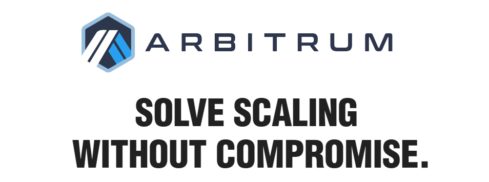

# ネットワーク追加: Arbitrum

September 21, 2022

## 概要

N Suiteを用いた暗号資産管理機能全般に、Arbitrumネットワークが追加されました。


2022年9月時点ではマルチシグ非対応となっております。


<figure><figcaption></figcaption></figure>

従来のメニューにネットワークが追加されており、これまで通りのUI操作でご利用いただけます。

<figure><figcaption></figcaption></figure>

<figure><figcaption></figcaption></figure>

他のチェーンと同様に、Arbitrum上で下記操作が行えます。

* トークンの送金
* スマートコントラクトのデプロイ
* コントラクトメソッドの実行（NFT発行等）

なおTestnetである**Arbitrum Nitro Testnet**も同時に追加が完了しており、利用可能となっております。

<figure><figcaption></figcaption></figure>

これからもユーザー様の利便性を追求しメジャーなチェーンへの対応を進めてまいります。
