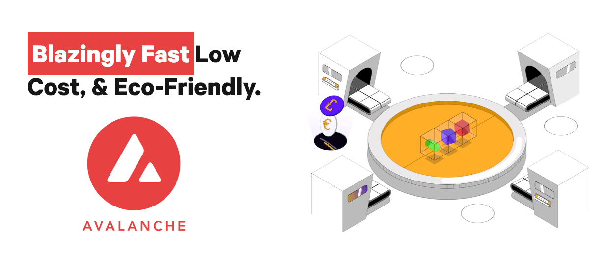

# ネットワーク追加: Avalanche / Testnet系

July 20, 2022

## 概要

N Suiteを用いた暗号資産管理機能全般に、AVAX (Avalanche), Fuji Testnet, Goerli Testnetの3つ追加されました。

<figure><figcaption></figcaption></figure>

従来のメニューに各種ネットワークが追加されており、これまで通りのUI操作でご利用いただけます。

.png>)

.png>)

他のチェーンと同様に、AVAX上で下記操作が行えます。

* トークンの送金
* スマートコントラクトのデプロイ
* コントラクトメソッドの実行（NFT発行等）

**Fuji Testnet**はAVAXのテスト用ネットワークですので、本番のデプロイ前など各種テスト用にご利用ください。**Goerli Testnet**に関しては、[Rinkeby Testnetが2023年に廃止される事が発表](https://blog.ethereum.org/2022/06/21/testnet-deprecation/)されたことを受け、Ethereumのテストネットワークとして追加しました。Rinkebyを用いたテスト環境等は順次、お早目にGoerliへの移行をお願いいたします。

これからもユーザー様の利便性を追求しメジャーなチェーンへの対応を進めてまいります。
