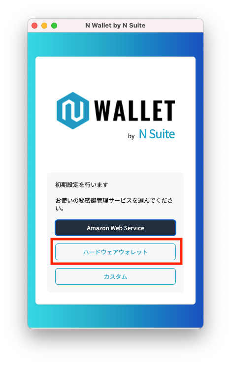

# N Walletの初期設定（Ledgerのアドレス登録）


Ledgerハードウェアウォレットで秘密鍵を管理している場合、本手順でN Walletにアドレスを登録してください。



本手順を行う場合、下記を済ませた状態のLedgerハードウェアウォレットをお手元にご用意した状態で作業を行ってください。

* 初期設定
* Ethereumアプリのインストール


① Chromeの画面右上の拡張機能アイコンをクリックし、表示されたポップアップでN Walletを選択

② N Walletの初期設定画面で、「ハードウェアウォレット」をクリック

<figure><figcaption></figcaption></figure>

③ ウォレット選択画面で、「Ledger」をクリック

④ Ledgerをお使いのPCに接続し、Ledgerの端末画面でEthereumのアプリを開く

⑤ ウォレット接続画面で「接続」ボタンをクリック

⑥ 表示されたポップアップで、Ledgerの機種名を選択し、「接続（Connect）」ボタンをクリック

⑦ 「HD Path」を指定し、登録するアドレスを選択した後、「登録」ボタンをクリック


**HD Pathについて**

下記に該当する場合、「Ledger Live」を選択してください。

* N Walletと連携して使用するために新しくLedgerを購入した。
* Ledger LiveでLedgerのアドレスを管理している。

\
すでに他のウォレットアプリ（MyEtherWalletなど）とLedgerを接続し、管理されている場合、管理に使用しているウォレットアプリと同じHD Pathを指定してください。


