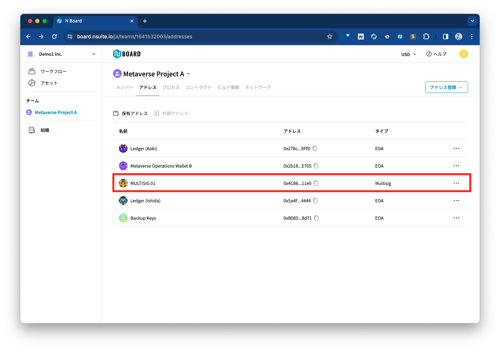
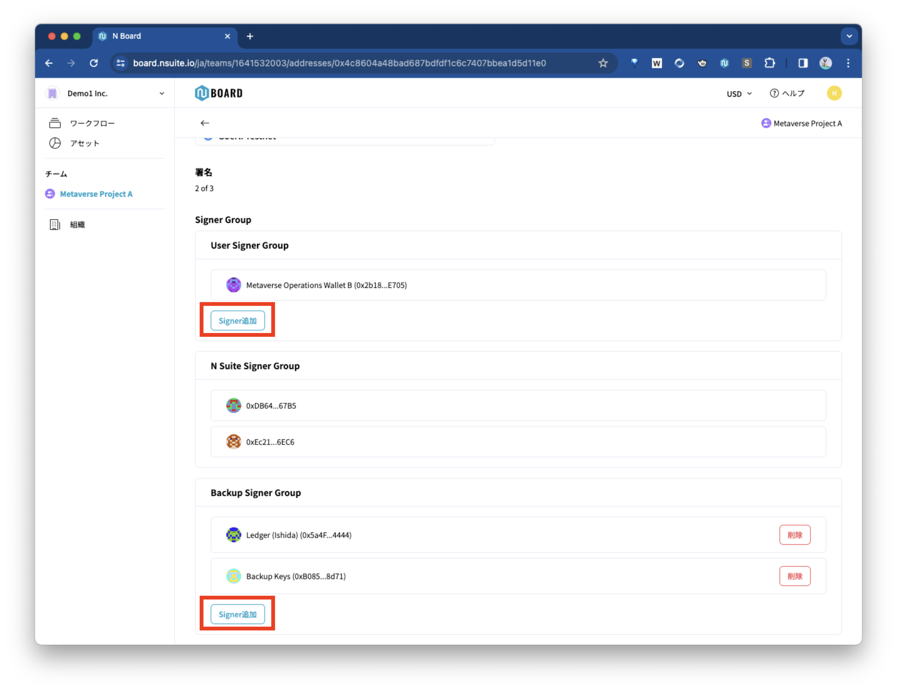
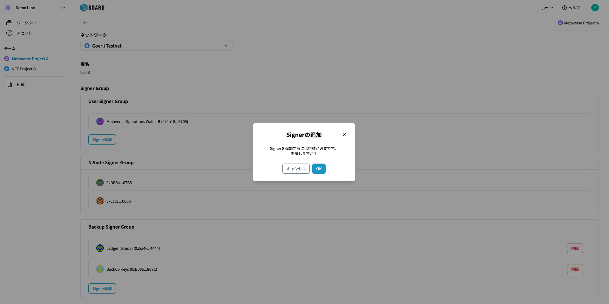

# 既存のマルチシグウォレットへアドレスを追加登録


マルチシグウォレットのSigner Groupには複数のアドレスを追加登録することができます。マルチシグのSigner GroupはUser Signer Group、Backup Signer Group、N Suite Signer Groupの3種類がありますが、N Board上で追加登録ができるのは、User Signer GroupとBackup Signer Groupです。


## **アドレスの追加方法** 

① 該当するマルチシグアドレスを選択する。

* チームの「アドレス」タブをクリックし、該当するマルチシグのアドレスをクリック

<figure><figcaption></figcaption></figure>

② Signerを追加する。

* アドレスのSigner Groupにそれぞれ「Signerの追加」ボタンがあるので、該当するボタンをクリックして追加

<figure><figcaption></figcaption></figure>

③ Signer Groupのアドレス追加のワークフローを実行する。

* 申請の作成 → 承認 → 実行を進めて、実行が完了すると、アドレスの追加が完了

<figure><figcaption></figcaption></figure>


マルチシグウォレットのSigner Groupにハードウェアウォレットを追加する場合は、事前にN Walletにアドレスを追加する必要があります。追加の方法は[こちら](/broken/pages/rlp3rVVJjMZYr2ay2xph)を確認してください。

