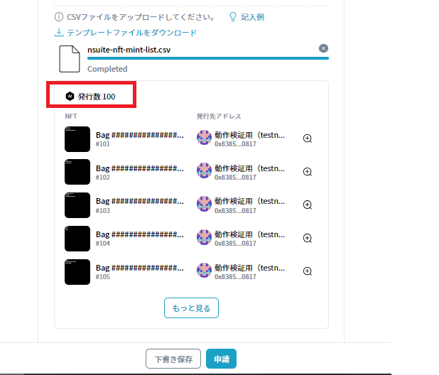
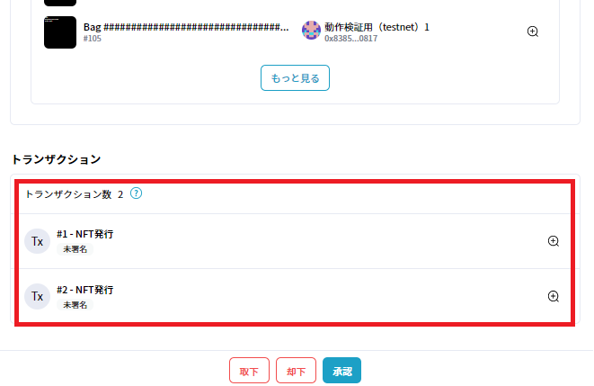
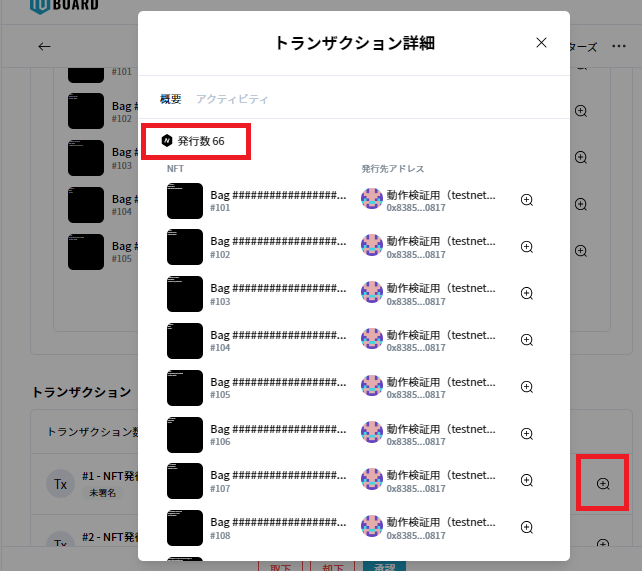
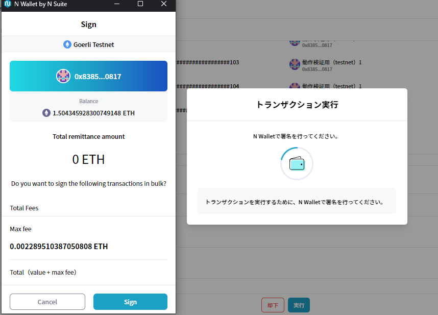
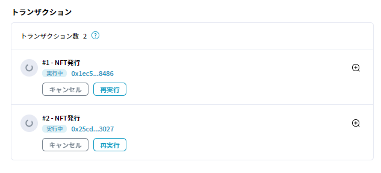
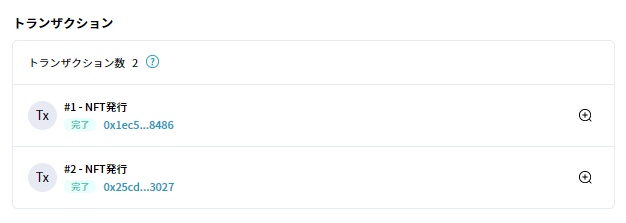

# NFT Mint 専用フォーム - 大量同時Mint

## 概要

一度の申請でNFTを100件、1000件規模Mint（発行）する場合は下記のようにMint専用フォームの挙動が変わりTxが自動分割されますので、予めご確認ください。


本機能はマルチシグウォレットは非対応となります。

必ずEOA (AWS KMSまたはLedger) をご利用ください。


## **操作手順**

申請作成においては、Mint数20件未満の小規模オペレーションと変わりません。テンプレファイルをアップロードした時点で発行数や内容が正しいことを確認し、そのまま続行してください。

<figure><figcaption>
申請前に発行数が正しいことをご確認ください
</figcaption></figure>

申請をすると、下記のようにトランザクションが自動で分割されます。

<figure><figcaption></figcaption></figure>

また右側の虫眼鏡をクリックすると、トランザクションの詳細が一つ一つ確認可能です。下記のサンプルは一個目のトランザクションには66件のNFTが登録されました。

<figure><figcaption></figcaption></figure>

実行操作も通常通りとなります。署名権限のあるアドレスで署名操作を行います。

<figure><figcaption></figcaption></figure>

署名操作をすると、実行中のステータスに遷移します。何かしらの理由で失敗してしまったトランザクションに関しては他のトランザクションが実行中でも再実行の操作が可能です。また、途中でキャンセルをすることも可能です。

<figure><figcaption></figcaption></figure>

トランザクションが実行終了すると、結果画面が表示されます。上の図では表示されていた「キャンセル」、「再実行」のボタンは消え、完了マークがついたことが確認できます。

<figure><figcaption></figcaption></figure>

**トランザクションをキャンセル・失敗した場合**

トランザクションに何らかの問題がありキャンセル・失敗してしまった場合は、下記のようにそれぞれ<mark style="color:yellow;">「キャンセル済み」(黄色）</mark>、<mark style="color:red;">「失敗」（赤色）</mark>と表示されます。この際、一番下のボタンより「一括で再実行」か個別に再実行ボタンを押すか任意で選択可能になります。

<figure><figcaption></figcaption></figure>
