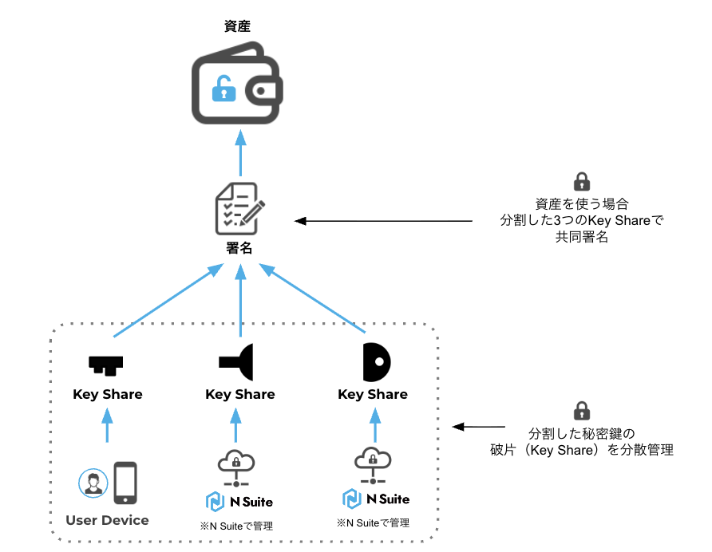

# MPCの概要

#### **MPCとは？** 

MPCはMuliti-Party Computationの略で、プライバシーやセキュリティーの課題に対しての解決策として注目されているブロックチェーン技術です。

クラウド型やハードウェア・ウォレット型などの従来の秘密鍵管理方法では、単一の秘密鍵が一箇所に集中していました。MPCを使用すると、複数のユーザーが異なるデバイスで秘密鍵の一部を保有し、誰も単独で完全な秘密鍵にアクセスできないシステムを構築する事ができます。

つまりMPCとは、一つの秘密鍵を複数の破片（Key Shareといいます）に分割し、分散管理する仕組みです。

#### **N SuiteにおけるMPCの設計** 

2024年11月にN Suiteは従来の秘密鍵管理方法に加えてMPCを採用しました。

N SuiteにおけるMPCの秘密鍵管理は、秘密鍵を3つに分割し、各破片（Key Shareといいます）をN Suiteのサーバーとモバイルアプリに分散して、ユーザーとN Suiteで管理する仕組みになっています。

<figure><figcaption></figcaption></figure>

従来のクラウド型での鍵管理方法では、N Suiteのユーザー企業がAWSと直接契約してAWS/KMSの秘密鍵を用意する必要がありました。またAWS/KMSの秘密鍵の初期設定など煩雑な作業をする必要がありました。MPCの鍵管理方法ではユーザー企業がAWSを用意しなくてもN Suiteを使って鍵管理をすることができるようになります。

従来、N Suite上で複数のユーザーが秘密鍵を管理する方法としてマルチシグアドレスが提供されていましたが、多くの場合マルチシグアドレスにはAWSのクラウドキーが利用されていました。MPCの鍵管理方法は、マルチシグアドレスとほぼ同等レベルのセキュリティーを提供することができます。つまりMPCの鍵管理方法では、ユーザー企業がAWSを用意しなくても、マルチシグアドレスと同様に誰も単独で完全な秘密鍵にアクセスできない環境を作ることができます。

なおMPC導入後もマルチシグアドレスを導入利用することが可能です。

#### **署名** 

MPCで送金などのトランザクションを実行する場合は、3つに分割したKey Share全ての署名が必要となります。ユーザーとN Suiteの両方が署名をしないとトランザクションを実行できない仕組みになっており、ユーザー企業の内部犯行の対策を取りやすくなっています。また、N Suiteだけの判断でもトランザクションを実行できない仕組みのため、ノンカストディのウォレットになっています。

#### **ユーザーのKey Shareのバックアップ**  

ユーザーがモバイルデバイスで保有するKey Shareは暗号化し、N Suiteのサーバー上でバックアップとして保管します。万が一、ユーザーがモバイルデバイスを紛失した場合は、N Suiteのサーバーに保管したバックアップからKey Shareを復元することができます。

#### **Key Shareの配布** 

同じアドレス群に対して、Key Share Groupのセットは何回も作り直すことができます。つまりKey Share GroupはKey Shareを保有するユーザーごとに生成することが可能です。

このような設計になっていることで、仮にKey Shareを保有するユーザーが退職などした場合は、Key Share Groupを破棄し、退職したユーザーが保有していたKey Shareを無効化することができるため、セキュリティーの観点でメリットがあります。

#### **アドレスの作成** 

一つのKey Shareのセット（Key Share Groupといいます）から複数のアドレスを生成することができるため、同じKey Share Groupで複数のアドレスを管理することが可能です。なお、同じKey Share Groupから半無限でアドレスを生成することができます。
